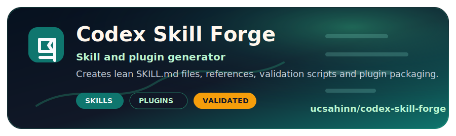
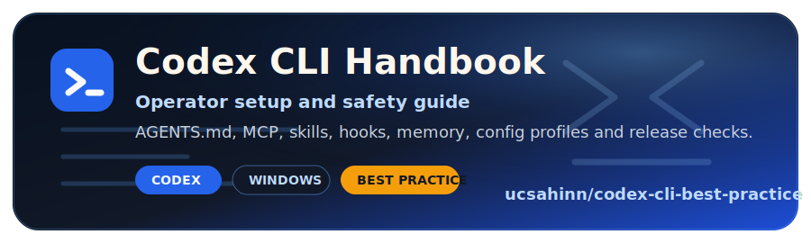

<h2>Security products, public trust surfaces and Codex-driven engineering systems.</h2>

   <strong>MyVuln</strong> for vulnerability intelligence ·
   <strong>PassMan</strong> for self-hosted enterprise vaults ·
   <strong>Codex Skill Forge</strong> for reusable AI-engineering workflows

  &#127760; <strong>Languages:</strong>
   |
   |
   |
   |
   |
  

  
  
  
  
  
  
  
  

  I ship public-safe security product hubs, release documentation, operator runbooks,
  skill/plugin tooling and repeatable verification workflows that people can clone, inspect and trust.

  
  
  

---

##  Start Here

| If you are looking for... | Start with |
| --- | --- |
|  Vulnerability intelligence and CVE workflows | [MyVuln live product](https://myvuln.io/) and [public hub](https://github.com/ucsahinn/myvuln) |
|  Self-hosted password and secret management | [PassMan release and docs hub](https://github.com/ucsahinn/passman) |
|  Create reusable Codex skills and plugins | [Codex Skill Forge](https://github.com/ucsahinn/codex-skill-forge) |
|  Operate Codex CLI safely with skills, agents, MCP and hooks | [Codex CLI Operator Handbook](https://github.com/ucsahinn/codex-cli-best-practice) |
|  Build source-backed implementation prompts | [Codex Enterprise Prompt Architect](https://github.com/ucsahinn/codex-enterprise-prompt-architect) |
|  Start context-heavy AI-coding repos | [Context Engineering Project Starter](https://github.com/ucsahinn/context-engineering-project-starter) |
|  Turkish cybersecurity content | [SiberDergi](https://siberdergi.net) |

##  What I Ship

-  Public-safe product hubs for security tools whose source code or operational data must stay private.
-  Self-hosted Windows release surfaces with manifests, operator runbooks and support evidence rules.
-  AI-assisted engineering workflows with skill routing, agent delegation, scoped execution, verification and clean handoff.
-  Turkish and English documentation for operators, buyers and technical reviewers.
-  Public repos that try to be cloneable, inspectable, validated and useful without private context.

##  Operating Loop

| Step | How I use it |
| --- | --- |
|  Research | Read the repo, docs, threat boundaries and release context before changing anything. |
|  Plan | Turn fuzzy goals into scoped work, verification gates and rollback-aware steps. |
|  Execute | Ship focused changes without weakening security, validation or support boundaries. |
|  Verify | Run the narrowest useful checks first, then broaden when the blast radius requires it. |
|  Ship | Publish clean docs, releases and handoff notes that a reviewer can trust. |

##  Featured Repos Worth Checking

If you want to follow or star something useful, start with these public projects:

<table>
  <tr>
    <td width="50%" valign="top">
      
       
      
      
      
    </td>
    <td width="50%" valign="top">
      
       
      
      
      
    </td>
  </tr>
  <tr>
    <td width="50%" valign="top">
      
       
      
      
      
    </td>
    <td width="50%" valign="top">
      
       
      
      
      
    </td>
  </tr>
  <tr>
    <td width="50%" valign="top">
      
       
      
      
      
    </td>
    <td width="50%" valign="top">
      
       
      
      
      
    </td>
  </tr>
  <tr>
    <td colspan="2" valign="top">
      
       
      
      
      
    </td>
  </tr>
</table>

## GitHub Signal

 

## Contribution Snake

<picture>
  <source media="(prefers-color-scheme: dark)" srcset="https://raw.githubusercontent.com/ucsahinn/ucsahinn/output/github-contribution-grid-snake-dark.svg" />
  <source media="(prefers-color-scheme: light)" srcset="https://raw.githubusercontent.com/ucsahinn/ucsahinn/output/github-contribution-grid-snake.svg" />
  
</picture>

## Tech Stack

  <strong>Languages:</strong>
  
  
  
  

  <strong>Frameworks:</strong>
  
  
  
  

  <strong>Data:</strong>
  
  
  
  

  <strong>Platforms:</strong>
  
  
  
  

  <strong>Workflow:</strong>
  
  
  
  

---

<strong>Build. Verify. Release.</strong>

 
 

