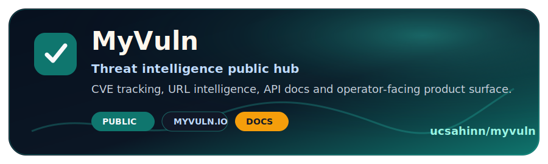
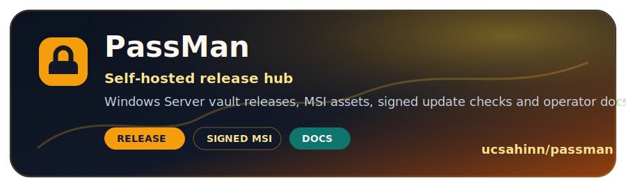
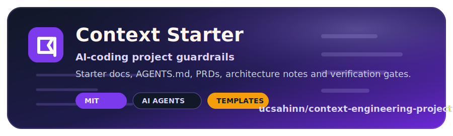
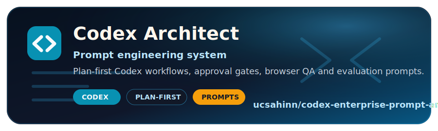
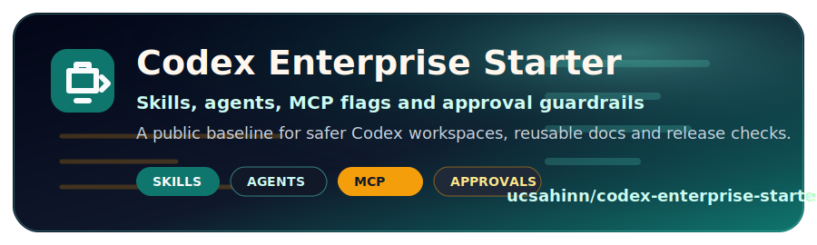
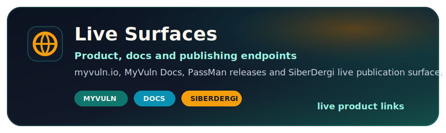

<h3>Security product builder focused on vulnerability intelligence, self-hosted vaults and Codex-driven engineering systems.</h3>

  🌐 <strong>Languages:</strong>
  <a href="README.de.md">🇩🇪 Deutsch</a> ·
  <a href="README.es.md">🇪🇸 Español</a> ·
  <a href="README.md">🇬🇧 English</a> ·
  <a href="README.pt-BR.md">🇧🇷 Português (Brasil)</a> ·
  <a href="README.tr.md">🇹🇷 Türkçe</a> ·
  <a href="README.fr.md">🇫🇷 French</a>

  
  
  
  
  
  

  I build public-safe trust surfaces for security products:
  live demos, release hubs, operator docs, support boundaries and repeatable agent workflows.

  
  
  

---

## Start Here

| If you are looking for... | Start with |
| --- | --- |
| Threat intelligence and CVE workflows | [MyVuln live product](https://myvuln.io/) and [public repository](https://github.com/ucsahinn/myvuln) |
| Self-hosted password and secret management | [PassMan release hub](https://github.com/ucsahinn/passman) |
| AI-coding project context and guardrails | [Context Engineering Project Starter](https://github.com/ucsahinn/context-engineering-project-starter) |
| Enterprise Codex setup with skills, agents, MCP and approval flags | [Codex Enterprise Starter](https://github.com/ucsahinn/codex-enterprise-starter) |
| Codex prompt systems for engineering workflows | [Codex Enterprise Prompt Architect](https://github.com/ucsahinn/codex-enterprise-prompt-architect) |
| Turkish cybersecurity content | [SiberDergi](https://siberdergi.net) |

## What I Ship

- Public-safe product hubs for security tools whose source code or operational data must stay private.
- Self-hosted Windows release surfaces with signed manifests, operator runbooks and support evidence rules.
- AI-assisted engineering workflows that force skill routing, agent delegation, scoped execution, verification and clean handoff.
- Turkish and English documentation for operators, buyers and technical reviewers.

## Operating Loop

| Step | How I use it |
| --- | --- |
| Research | Read the repo, docs, threat boundaries and release context before changing anything. |
| Plan | Turn fuzzy goals into scoped work, verification gates and rollback-aware steps. |
| Execute | Ship focused changes without weakening security, validation or support boundaries. |
| Verify | Run the narrowest useful checks first, then broaden when the blast radius requires it. |
| Ship | Publish clean docs, releases and handoff notes that a reviewer can trust. |

## Featured Repos Worth Checking

If you want to follow or star something useful, start with these:

<table>
  <tr>
    <td width="50%" valign="top">
      
       
      
      
      
    </td>
    <td width="50%" valign="top">
      
       
      
      
      
    </td>
  </tr>
  <tr>
    <td width="50%" valign="top">
      
       
      
      
      
    </td>
    <td width="50%" valign="top">
      
       
      
      
      
    </td>
  </tr>
  <tr>
    <td colspan="2" valign="top">
      
       
      
      
      
      
    </td>
  </tr>
  <tr>
    <td colspan="2" valign="top">
      
       
      
      
      
    </td>
  </tr>
</table>

## GitHub Signal

 

## Contribution Snake

<picture>
  <source media="(prefers-color-scheme: dark)" srcset="https://raw.githubusercontent.com/ucsahinn/ucsahinn/output/github-contribution-grid-snake-dark.svg" />
  <source media="(prefers-color-scheme: light)" srcset="https://raw.githubusercontent.com/ucsahinn/ucsahinn/output/github-contribution-grid-snake.svg" />
  
</picture>

## Tech Stack

  <strong>Languages:</strong>
  
  
  
  

  <strong>Frameworks:</strong>
  
  
  
  

  <strong>Data:</strong>
  
  
  
  

  <strong>Platforms:</strong>
  
  
  
  

  <strong>Workflow:</strong>
  
  
  
  

---

<strong>Build. Verify. Release.</strong>

 
 

